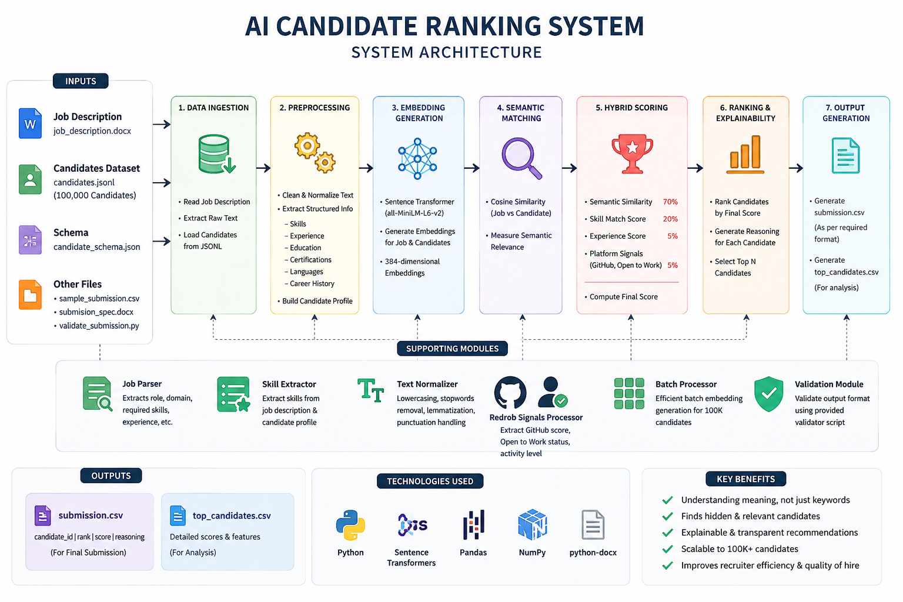

# AI Candidate Ranking System

## Problem Statement

## Solution Overview

## System Architecture

## Workflow

1. Read Job Description
2. Parse Requirements
3. Read Candidate Profiles
4. Generate Semantic Embeddings
5. Compute Cosine Similarity
6. Skill Matching
7. Hybrid Scoring
8. Explainable Ranking
9. Generate submission.csv

## Technologies Used

- Python
- Sentence Transformers
- Transformers
- Scikit-learn
- Pandas
- NumPy

## Folder Structure

## Installation

pip install -r requirements.txt

## Run

python main.py

## Output

output/submission.csv

## Future Improvements

- Batch Embeddings
- FAISS
- LLM Re-ranking
- Streamlit Dashboard